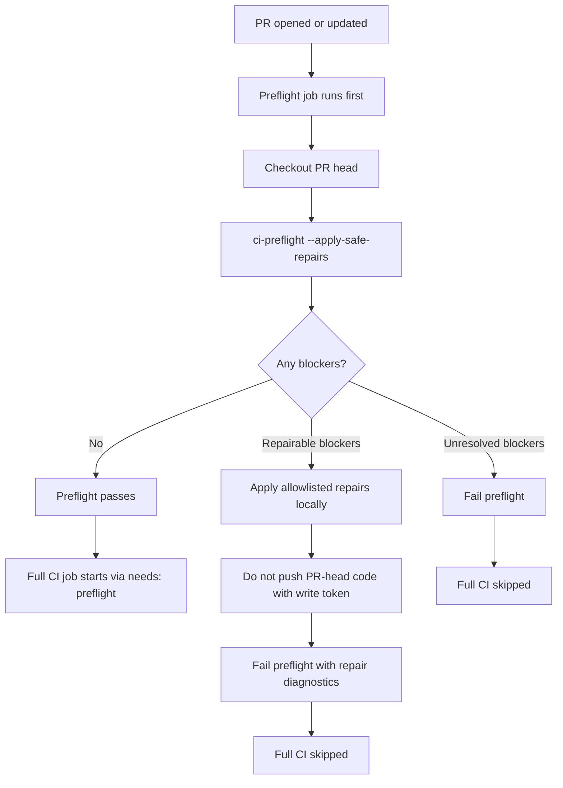
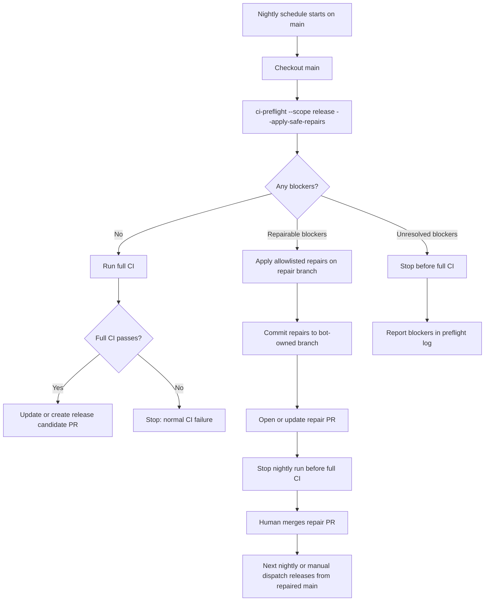

<!-- owner: pipeline-contracts-template -->

# Contract for `scripts/ci-preflight.sh`

## Surface

Readiness gate that runs before expensive CI. It checks cheap known blockers,
optionally applies allowlisted deterministic repairs, commits repair output only
in explicitly trusted modes, and stops the current run when unresolved blockers
or repair commits remain. Full CI must validate the repaired commit in a fresh
run.

Usage:

```bash
bash scripts/ci-preflight.sh [--apply-safe-repairs] [--scope standard|release] [--branch-context auto|in-flight|integration] [--continue-after-repair] [--repair-commit-mode none|same-branch|repair-pr]
```

## Protocol

### Arguments

- `--apply-safe-repairs` attempts allowlisted repairs. Without this flag,
  preflight is read-only.
- `--scope standard|release` selects standard blockers only, or standard plus
  release-lane blockers. Default: `standard`.
- `--branch-context auto|in-flight|integration` selects how Check 7 built-state
  drift is gated (see *Branch context* below). Default: `auto`. `--scope release`
  always forces `integration` regardless of this flag.
- `--continue-after-repair` allows a local/debug caller to exit 0 after repairs
  resolve blockers. Hosted workflows do not set this flag.
- `--repair-commit-mode none|same-branch|repair-pr` controls automated repair
  commits. Default: `none`.
- `--repair-branch <branch>` names the branch used by `same-branch` push or
  `repair-pr` automation.
- `--push-safe-repairs` permits `same-branch` mode to push the committed repair
  to `origin`.
- `--gh-cmd <path>` selects the provider CLI for repair PR create/update.
- `--root <path>` is a developer/test argument that runs checks against another
  project root. Relative roots are canonicalized before the helper changes
  directory.

### Exit codes

- `0` - no blockers remain and no repair diff or repair commit blocks
  continuation.
- `1` - blockers remain, or repairs were applied/committed and the current run
  must stop so a fresh SHA can be validated.
- `2` - invalid arguments or missing required helper/provider.

### Safe repairs

- `scripts/health-check.sh --reconcile` for unrecorded Check 7 active-to-stale
  drift. Preflight blocks on the unrecorded drift line that says to run with
  `--reconcile`; a later `status=stale` warning is recorded drift for
  `/consolidate`, not a pointless-CI blocker.
- `scripts/generate-coverage.sh` when `scripts/validate-coverage-manifest.sh`
  reports `COVERAGE-MANIFEST-DRIFT`.

Preflight must not run `/consolidate`, rewrite human-authored spec prose,
resolve merge conflicts, edit release intent, or repair arbitrary smoke-test
failures.

### Branch context

Check 7 built-state drift ("an `active` spec's owned file was modified after the
spec's last commit") is **expected** on an in-flight feature branch — it is
reconciled at `/consolidate` before merge — but represents real un-reconciled
state on the integration/default branch. Preflight gates it by context:

- **integration** — Check 7 drift blocks (or safe-repairs under the trusted
  commit modes), exactly as the *Safe repairs* section describes.
- **in-flight** — Check 7 drift is **non-blocking**: preflight prints a visible
  `WARNING:` naming the drifted spec(s), does not reconcile or flip status, and
  continues. Drift is never silently suppressed — the warning always prints.

`--branch-context auto` (default) resolves context by comparing HEAD's commit to
the tip of `refs/remotes/origin/<default-branch>` by SHA (robust to detached-HEAD
CI checkouts): equal → `integration`, otherwise → `in-flight`. If either ref is
unresolvable (e.g. no `origin` configured locally), it falls back to `in-flight`
so local feature work is never blocked; hosted CI fetches the ref, so the
integration gate stays intact there. `CI_PREFLIGHT_DEFAULT_BRANCH` (default
`main`) names the integration branch. `--branch-context in-flight|integration`
overrides detection; `--scope release` always forces `integration`.

This context gate applies **only** to Check 7 drift. Coverage-manifest drift and
release-scope blockers are unaffected. If the health-check output carries a
non-Check-7 failure alongside the Check 7 drift (any `✗` line that is not the
Check 7 drift marker), preflight **still blocks** even on an in-flight branch —
the in-flight downgrade never hides a non-Check-7 health failure.

### Environment

- `CI_PREFLIGHT_DEFAULT_BRANCH` — names the integration branch for `auto`
  branch-context detection. Default: `main`.

### Release scope

Release scope runs the standard blocker set first, then runs the nightly release
workflow smoke and release-candidate helper smoke as early blockers. Release
scope failures are not repaired automatically.

### Automated commit modes

- `none` leaves repair diffs for the caller to review and exits 1 unless
  `--continue-after-repair` is set.
- `same-branch` requires a clean pre-repair worktree, stages only repair output,
  commits with the configured bot identity, and pushes only when a trusted
  caller supplies `--push-safe-repairs` plus `--repair-branch`.
- `repair-pr` requires a clean pre-repair worktree, commits on a bot-owned
  repair branch, validates any existing same-repo repair PR ownership before
  changing the branch, pushes with a lease, and creates or updates one marked
  repair PR.

Generated repair PR bodies start with:

```markdown
<!-- arboretum-ci-preflight-repair:bot-owned -->
```

The helper may update an existing repair PR only when this marker is present.

### Manual PR automation



### Nightly automation



## Test surface

- **CLI-1: Contract shape.** The contract names safe repairs, release scope,
  automated commit modes, branch context, and the manual PR/nightly diagrams.
- **CLI-2: Clean standard preflight.** A fixture with no unrecorded drift and
  fresh coverage exits 0 and prints `PREFLIGHT OK`.
- **CLI-3: Recorded stale drift does not block.** A fixture whose health check
  emits `status=stale` but no unrecorded drift exits 0.
- **CLI-4: Read-only drift blocks without mutation.** Unrecorded Check 7 drift
  exits 1 without changing fixture files when `--apply-safe-repairs` is absent.
- **CLI-5: Safe repair leaves reviewable diff by default.** With
  `--apply-safe-repairs`, unrecorded drift is reconciled and reported, but the
  command exits 1 because repair output must be reviewed or committed.
- **CLI-6: Local continue escape hatch.** The same repair exits 0 only with
  `--continue-after-repair`.
- **CLI-7: Same-branch auto-commit stops current run.** Same-branch mode commits
  repair output from a clean tree, leaves the tree clean, and exits 1.
- **CLI-8: Repair PR mode creates a marked bot PR.** Repair-PR mode commits on
  the configured branch, refuses human-owned existing repair PRs before pushing,
  pushes it, and calls the provider to create/update a marked PR body.
- **CLI-9: Coverage drift repair.** `COVERAGE-MANIFEST-DRIFT` triggers
  `scripts/generate-coverage.sh` only in repair mode.
- **CLI-10: Release-scope blockers stop early.** Release-scope smoke failures
  exit 1 and are not repaired automatically.
- **CLI-11: In-flight drift is non-blocking.** On a feature branch (HEAD differs
  from `origin/<default>`), unrecorded Check 7 drift exits 0, prints a `WARNING:`
  naming the drifted spec, reports `branch-context=in-flight`, and does not flip
  the spec — even with `--apply-safe-repairs`.
- **CLI-12: Integration drift still blocks.** With `--branch-context integration`
  (or on the default branch), unrecorded Check 7 drift exits 1 as in CLI-4/CLI-5.
- **CLI-13: Explicit context overrides detection.** `--branch-context in-flight`
  is non-blocking even on the default branch; `--branch-context integration`
  blocks even on a feature branch.
- **CLI-14: Release scope forces integration.** `--scope release` blocks Check 7
  drift even on a feature branch.
- **CLI-15: Auto fallback is in-flight.** When `origin/<default>` is unresolvable,
  `auto` resolves to in-flight (non-blocking). An invalid `--branch-context`
  value exits 2 with a named diagnostic.
- **CLI-16: In-flight downgrade is Check-7-only.** When the health-check output
  carries a non-Check-7 failure alongside Check 7 drift, preflight blocks (exit 1)
  even on an in-flight branch — the warning path never hides other health failures.

## Versioning

- **1.1** - add `--branch-context` (auto|in-flight|integration) and
  `CI_PREFLIGHT_DEFAULT_BRANCH`; Check 7 built-state drift is non-blocking on
  in-flight feature branches, blocking at integration/release (#612, 2026-06-06).
- **1.0** - initial standard CI preflight contract with safe repair and scoped
  automated repair commits (2026-06-06).
