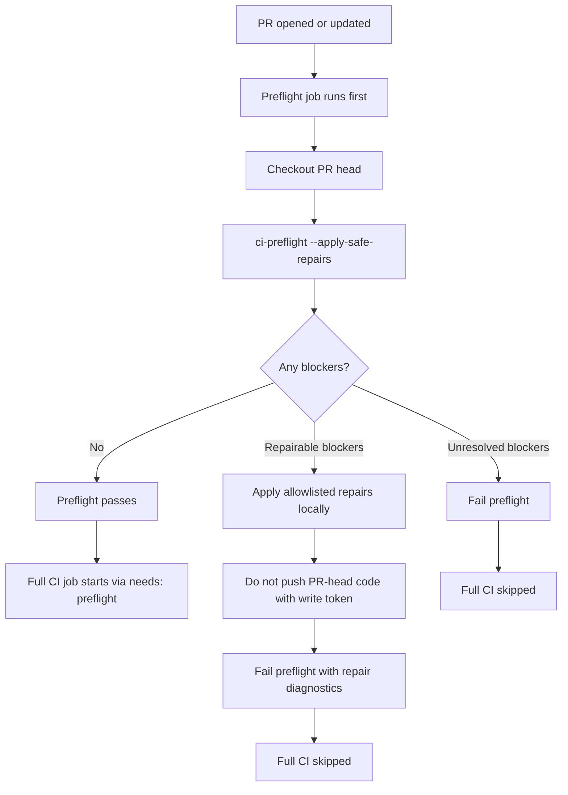
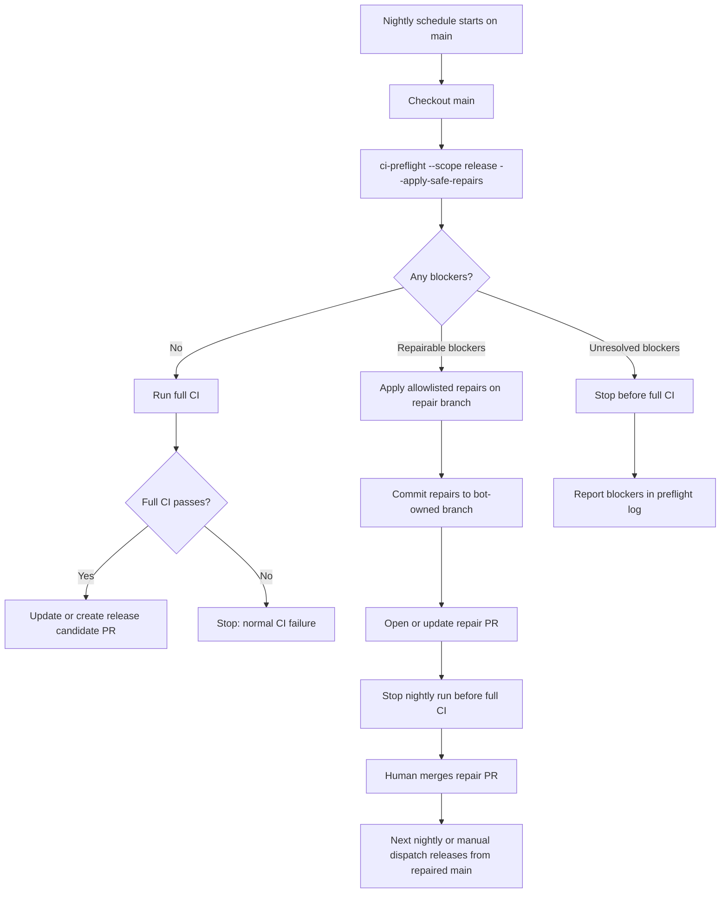

<!-- owner: pipeline-contracts-template -->

# Contract for `scripts/ci-preflight.sh`

## Surface

Readiness gate that runs before expensive CI. It checks cheap known blockers,
optionally applies allowlisted deterministic repairs, commits repair output only
in explicitly trusted modes, and stops the current run when unresolved blockers
or repair commits remain. Full CI must validate the repaired commit in a fresh
run.

Usage:

```bash
bash scripts/ci-preflight.sh [--apply-safe-repairs] [--scope standard|release] [--continue-after-repair] [--repair-commit-mode none|same-branch|repair-pr]
```

## Protocol

### Arguments

- `--apply-safe-repairs` attempts allowlisted repairs. Without this flag,
  preflight is read-only.
- `--scope standard|release` selects standard blockers only, or standard plus
  release-lane blockers. Default: `standard`.
- `--continue-after-repair` allows a local/debug caller to exit 0 after repairs
  resolve blockers. Hosted workflows do not set this flag.
- `--repair-commit-mode none|same-branch|repair-pr` controls automated repair
  commits. Default: `none`.
- `--repair-branch <branch>` names the branch used by `same-branch` push or
  `repair-pr` automation.
- `--push-safe-repairs` permits `same-branch` mode to push the committed repair
  to `origin`.
- `--gh-cmd <path>` selects the provider CLI for repair PR create/update.
- `--root <path>` is a developer/test argument that runs checks against another
  project root. Relative roots are canonicalized before the helper changes
  directory.

### Exit codes

`ci-preflight.sh`'s own exit code:

- `0` - no blockers remain and no repair diff or repair commit blocks
  continuation.
- `1` - blockers remain, or repairs were applied/committed and the current run
  must stop so a fresh SHA can be validated.
- `2` - invalid arguments or missing required helper/provider.

### Side effects

- **Read-only by default.** Without `--apply-safe-repairs`, preflight only reads
  and reports; it makes no filesystem or git changes.
- **Never mutates spec status.** Preflight does not run `health-check.sh
  --reconcile`, does not flip any spec `status:`, and does not edit spec prose —
  health-check drift is advisory and reconciled by `/consolidate`, not here.
- **Coverage repair (only with `--apply-safe-repairs`).** Regenerates
  `docs/contracts/_coverage.md` via `scripts/generate-coverage.sh`, leaving a
  reviewable working-tree diff.
- **Repair commits/pushes (only in the trusted commit modes).** `same-branch`
  commits coverage-repair output with the bot identity (and pushes only with
  `--push-safe-repairs` + `--repair-branch`); `repair-pr` commits on a bot-owned
  branch, force-pushes with a lease, and creates/updates one marked repair PR via
  the provider CLI.

### Health-check severity

Preflight treats `scripts/health-check.sh`'s **exit code as the single severity
authority** (the three-level code S2/#641 introduced: `0` clean, `1` ≥1 blocking
finding `✗`, `2` advisory-only findings `⚠`). It reads the code and never
re-derives severity from the output text or the git branch — the content-aware
classifier (S1/#238, S2/#641) already tagged each finding's severity:

- health-check exit `0` → `PASS`.
- health-check exit `2` → **advisory**, non-blocking. Preflight prints the `⚠`
  finding line(s) under an `ADVISORY:` heading and continues. This holds on
  **every branch** — Check 7 built-state drift is advisory because it is
  reconciled at `/consolidate`, so there is no in-flight vs. integration special
  case. Preflight never reconciles or flips spec status.
- health-check exit `1` → **blocking**. Preflight prints the `✗` line(s) and
  registers a blocker.
- any other exit code → treated as **blocking** (fail closed).

### Safe repairs

- `scripts/generate-coverage.sh` when `scripts/validate-coverage-manifest.sh`
  reports `COVERAGE-MANIFEST-DRIFT`.

Health-check drift is **not** a safe-repair target: it is advisory (surfaced,
not reconciled). Preflight must not run `/consolidate` or
`scripts/health-check.sh --reconcile`, rewrite human-authored spec prose, flip
spec status, resolve merge conflicts, edit release intent, or repair arbitrary
smoke-test failures.

### Release scope

Release scope runs the standard blocker set first, then runs the nightly release
workflow smoke and release-candidate helper smoke as early blockers. Release
scope failures are not repaired automatically.

### Automated commit modes

- `none` leaves repair diffs for the caller to review and exits 1 unless
  `--continue-after-repair` is set.
- `same-branch` requires a clean pre-repair worktree, stages only repair output,
  commits with the configured bot identity, and pushes only when a trusted
  caller supplies `--push-safe-repairs` plus `--repair-branch`.
- `repair-pr` requires a clean pre-repair worktree, commits on a bot-owned
  repair branch, validates any existing same-repo repair PR ownership before
  changing the branch, pushes with a lease, and creates or updates one marked
  repair PR.

Generated repair PR bodies start with:

```markdown
<!-- arboretum-ci-preflight-repair:bot-owned -->
```

The helper may update an existing repair PR only when this marker is present.

### Manual PR automation



### Nightly automation



## Test surface

- **CLI-1: Contract shape.** The contract names safe repairs, release scope,
  automated commit modes, the three-level exit-code severity read (advisory), and
  the manual PR/nightly diagrams.
- **CLI-2: Clean standard preflight.** A fixture with health-check exit 0 and
  fresh coverage exits 0 and prints `PREFLIGHT OK`.
- **CLI-3: Advisory drift is non-blocking on every branch.** Health-check exit 2
  (e.g. Check 7 built-state drift) is surfaced under `ADVISORY:`, exits 0, and
  does not flip the spec — on the default branch, no branch-context needed.
- **CLI-4: Blocking findings block.** Health-check exit 1 exits 1 and names the
  blocker.
- **CLI-5: Unexpected exit code fails closed.** A health-check exit code other
  than 0/1/2 is treated as blocking (exit 1) and reported.
- **CLI-6: Recorded stale drift does not block.** A health-check advisory for an
  already-recorded `status=stale` spec exits 0.
- **CLI-7: Coverage drift read-only blocks.** `COVERAGE-MANIFEST-DRIFT` without
  `--apply-safe-repairs` exits 1 and names the blocker.
- **CLI-8: Coverage safe repair leaves reviewable diff by default.** With
  `--apply-safe-repairs`, coverage drift is regenerated and reported, but the
  command exits 1 because repair output must be reviewed or committed.
- **CLI-9: Local continue escape hatch.** Coverage repair exits 0 with
  `--continue-after-repair` and marks the manifest fresh.
- **CLI-10: Same-branch auto-commit stops current run.** Same-branch mode commits
  coverage-repair output from a clean tree, leaves the tree clean, and exits 1.
- **CLI-11: Repair PR mode creates a marked bot PR.** Repair-PR mode commits on
  the configured branch, refuses human-owned existing repair PRs before pushing,
  pushes it, and calls the provider to create/update a marked PR body.
- **CLI-12: Release-scope blockers stop early.** Release-scope smoke failures
  exit 1 and are not repaired automatically.

## Versioning

- **1.2** - preflight reads `health-check.sh`'s three-level exit code as the
  single severity authority; Check 7 built-state drift is advisory (surfaced,
  non-blocking) on **every** branch. Removes `--branch-context`,
  `CI_PREFLIGHT_DEFAULT_BRANCH`, and the health-drift `--reconcile` safe-repair;
  fixes #608/#612 at the root (#642, 2026-06-08).
- **1.1** - add `--branch-context` (auto|in-flight|integration) and
  `CI_PREFLIGHT_DEFAULT_BRANCH`; Check 7 built-state drift is non-blocking on
  in-flight feature branches, blocking at integration/release (#612, 2026-06-06).
- **1.0** - initial standard CI preflight contract with safe repair and scoped
  automated repair commits (2026-06-06).
